# SaaS Satellite Teleport Service Provider Application

## Overview

This repository contains the source code for a SaaS application that enables satellite teleport service providers to manage their gateways. The application comprises a backend developed using Django REST framework and a frontend built with React.

## Features

### Satellite Teleport Service Provider Administrator:

- Create new administrator.
- Create new operator.
- Create new gateway.
- Edit existing gateway.
- Delete existing gateway.
- Retrieve company gateways.

### Satellite Teleport Service Provider Operator:

- Retrieve company gateways.

## Backend Implementation

The backend is developed using Django REST framework. It includes models for administrators, operators, and gateways, along with corresponding views and serializers. Authentication is handled using username and password.

### Setup Instructions:

1. Navigate to the `backend-python` directory.
2. Install the required dependencies using `pip install -r requirements.txt`.
3. Apply migrations using `python manage.py migrate`.
4. To create a superuser Run the `python manage.py create_superuser`
5. Start the development server using `python manage.py runserver`.
6. The database used is sqlite database

## Frontend Implementation

The frontend is built with React. It allows administrators to perform actions like adding/editing/deleting gateways and retrieving company gateways. Operators can retrieve company gateways.

### Setup Instructions:

1. Navigate to the `frontend` directory.
2. Install the required dependencies using `npm install`.
3. Start the frontend server using `npm start`.

## Before opening the application
1. Create a new user with different role as adminstrator or operator. 
2. Create a new company so that the gateway can link to the company. 
3. If the role is 'administrator', the user is able to perform CRUD in company, gateway and can create a new user and can view the admin dashboard with CRUD operations in table 
4. If the role is 'operator', the user can view the company and gateways but cant perform the create , delete , put operation and cannot see the admin dashboard

## Running the Application

1. Start the backend server using the instructions provided in the Backend Implementation section.
2. Start the frontend server using the instructions provided in the Frontend Implementation section.
3. Access the application in your browser at `http://localhost:3000`.

## Testing

Both the backend and frontend have comprehensive test suites to ensure the functionality works as expected.

### Backend Testing:

1. Run backend tests using `python manage.py test`.

### Frontend Testing:

1. Navigate to the `frontend` directory.
2. Run frontend tests using `npm test`.

## Application Overview Screenshot 

### Login page 

### Dashboard page with empty gateways
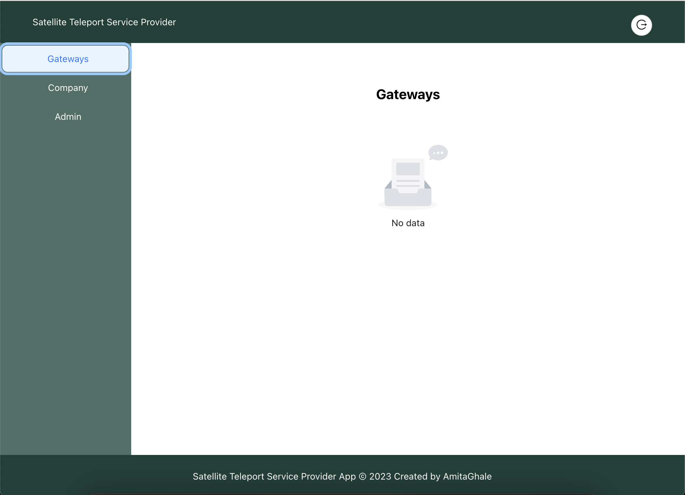

## Operator role View 

### Dashboard page with list of gateways
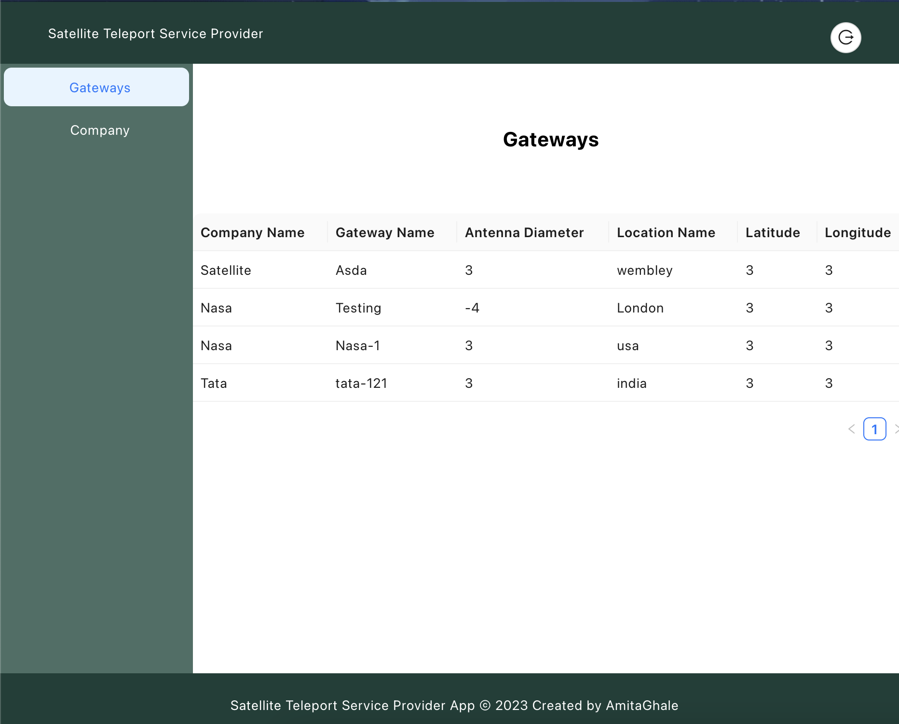
### Company page 
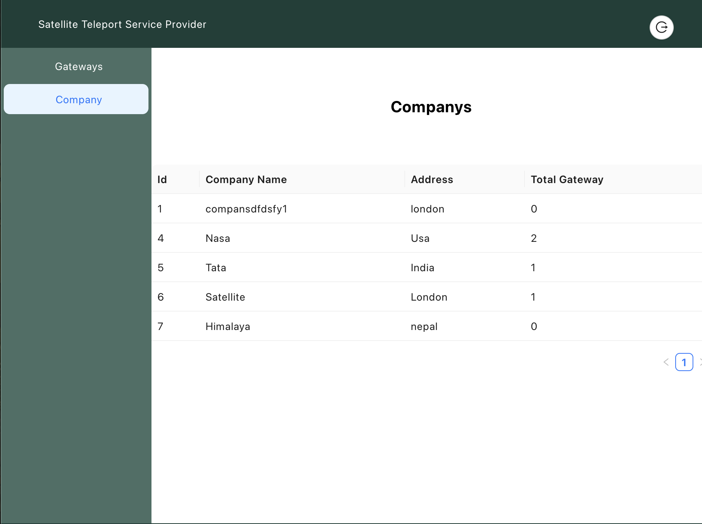

## Administrator role View 

### Dashboard page 
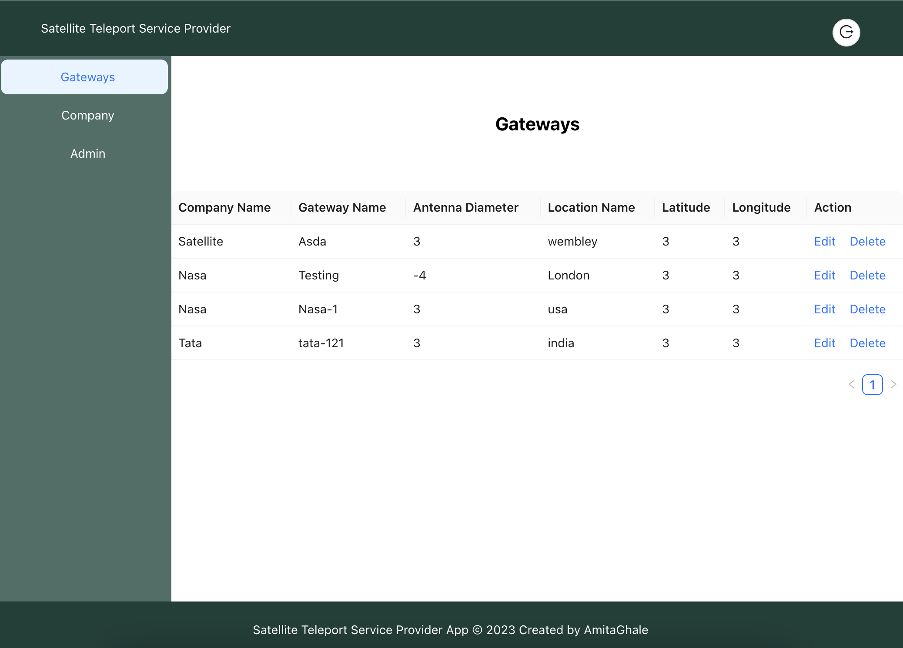
### Update Gateway 
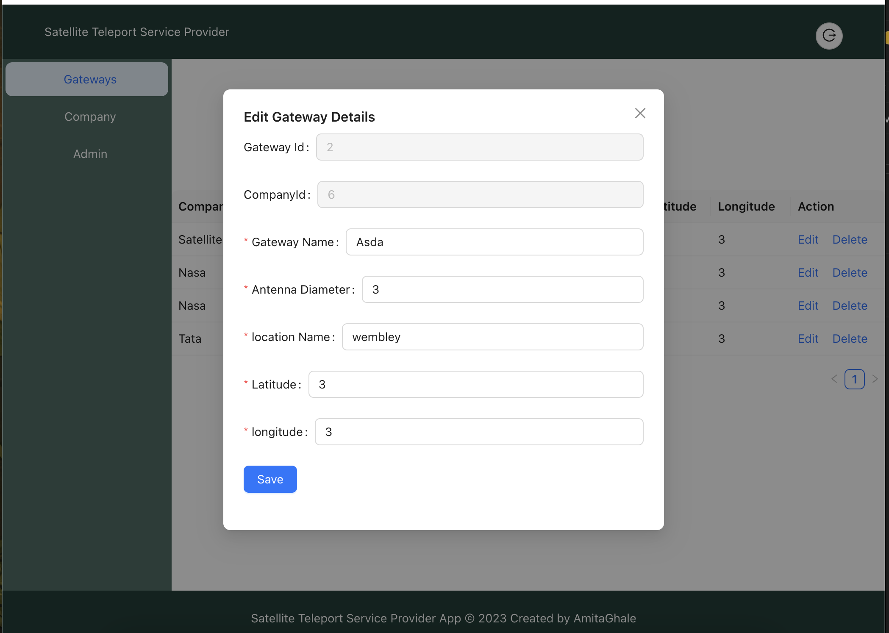
### Company page
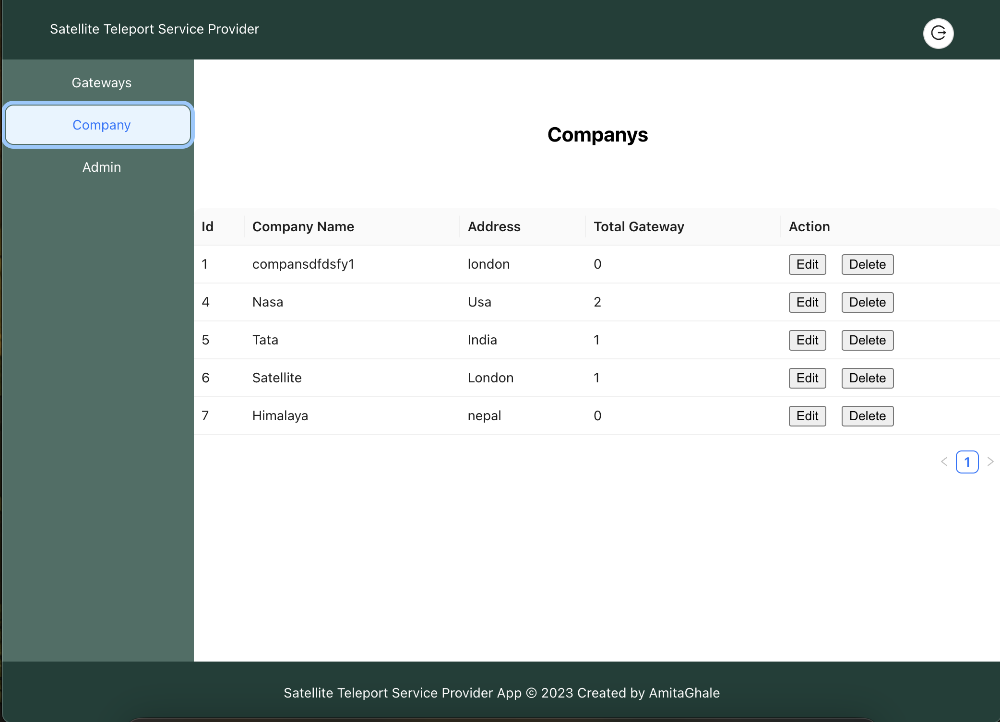 
### Update Company
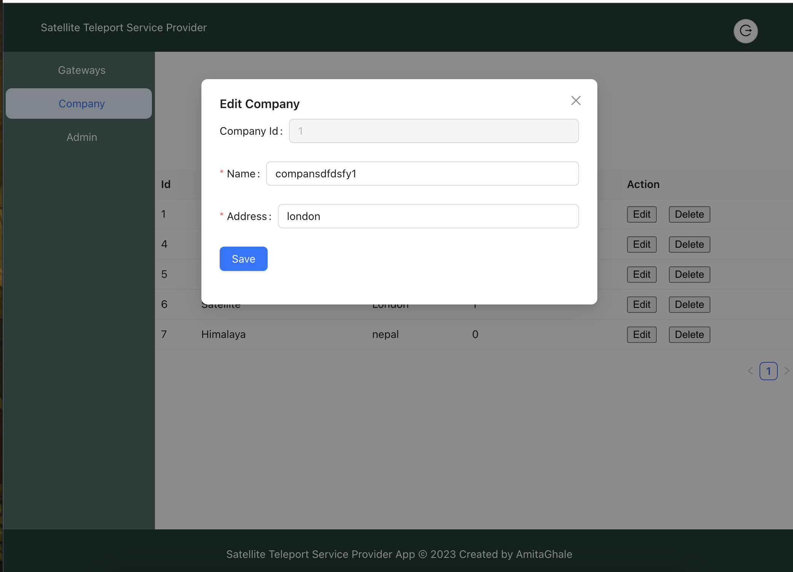
### Admin page 
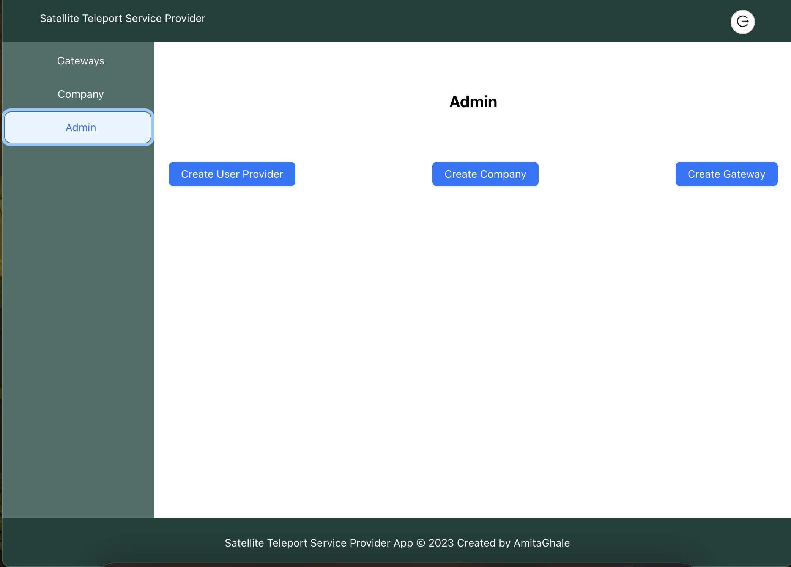
### Create new user modal
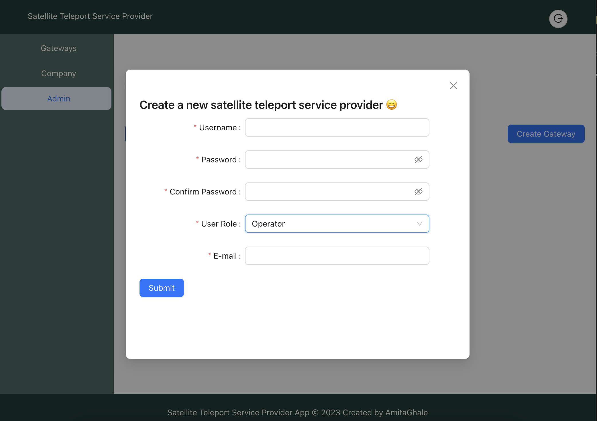 
### Create new company modal
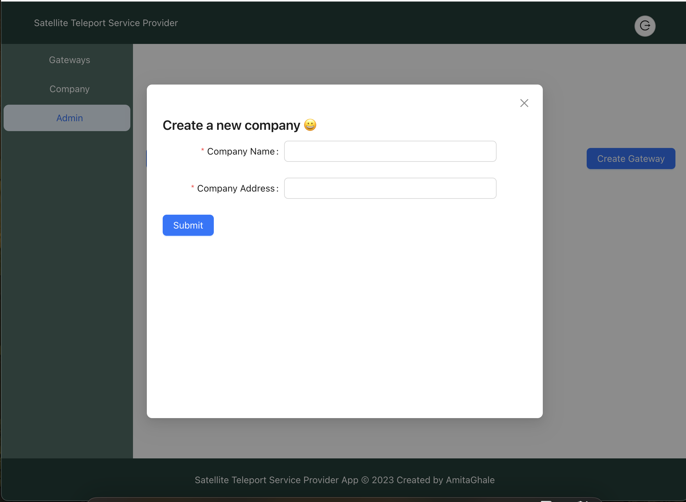 
### Create new gateway modal 
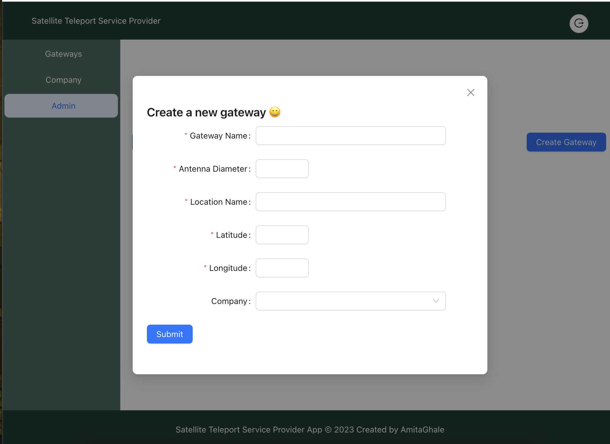

## Improvement for future use 

1. Testing needs improvement to support integration f the application, frontend and backend. 
2. Extra features in terms of backend and frontend

For any questions or concerns, please contact [Amita Ghale](mailto:amitaghale@gmail.com).
